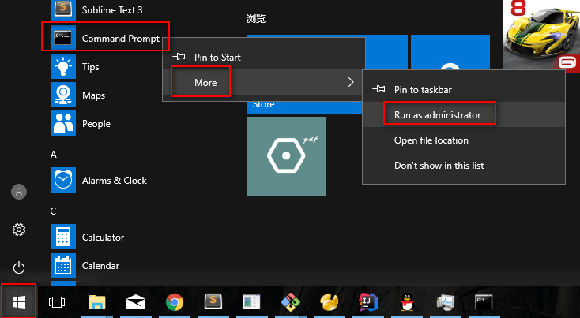
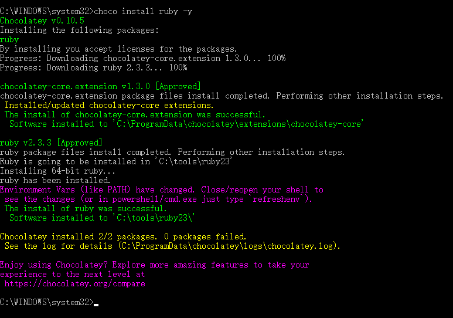
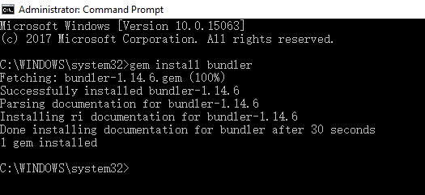
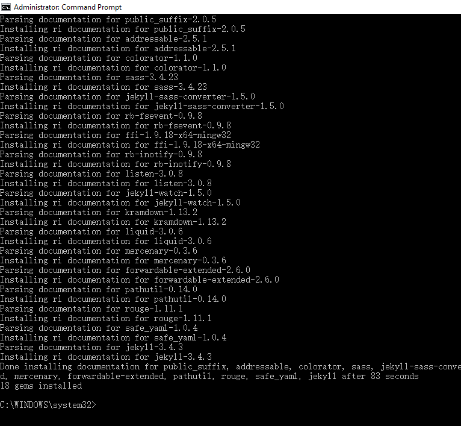

### how to install jekelly in windows
- first install Chocolatey 
- open cmd with Administrator like this 

 
- then copy this code and past it in you cmd
```
@powershell -NoProfile -ExecutionPolicy Bypass -Command "iex ((New-Object System.Net.WebClient).DownloadString('https://chocolatey.org/install.ps1 && SET "PATH=%PATH%;%ALLUSERSPROFILE%\chocolatey\bin"
```
- then you wait untill success
- now close the current cmd window ,and open another as Administrator,
- copy this code `choco feature enable -n useFipsCompliantChecksums` and past it
- after success then copy this code 'choco install ruby -y' and wait untill success 
- success view like this 
  
- now close and open a new command prompt with Administrator access
- install gem bundler `gem install bundler` and then wait untill success like this
  
- install jekyll `gem install jekyll` and then wait untill success like this 
  
- ok all success great now you can use jekyll happness