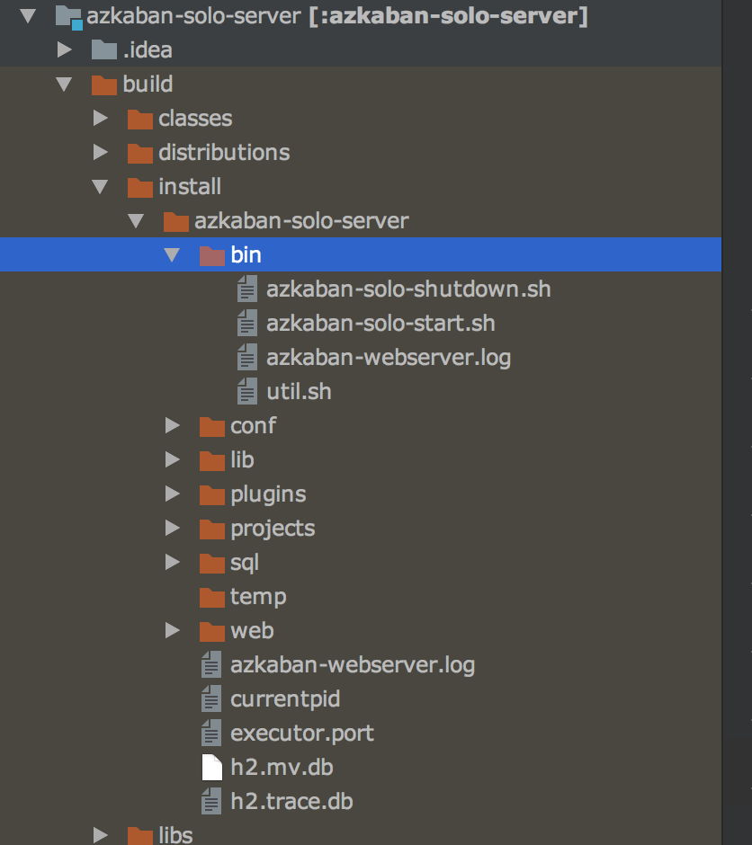
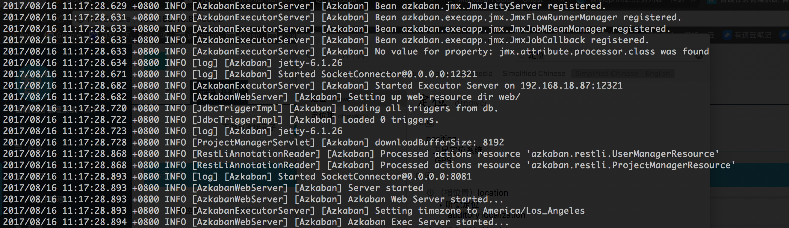

## Azkaban source code run in local

1. Install azkaban cource code in [azkaban](https://azkaban.github.io)

2. Open source in Intellij ideal then change the file **build.gradle** to this 

   ```groovy
   buildscript {
       repositories {
           mavenLocal() //use local maven repostory
           maven { url "http://repo.spring.io/snapshot" }
           maven { url "http://repo.spring.io/milestone" }
           maven { url "http://192.168.50.152:8081/nexus/content/groups/public" } // use private maven repostory
           mavenCentral()
           maven {
               url 'https://plugins.gradle.org/m2/'
           }
       }
       dependencies {
           classpath 'com.cinnober.gradle:semver-git:2.2.3'
           classpath 'net.ltgt.gradle:gradle-errorprone-plugin:0.0.10'
       }
   }
   ```

3. Open file **azkaban-solo-server** then open **build** like this  

4. location bin directory in terminal then run command 'bin/azkaban-solo-start.sh' then you will see this  this means the azkaban has been started ,then you can visit it in browse,the default port is 8081 , 

   the default username is `azkaban` , password is `zakaban` 