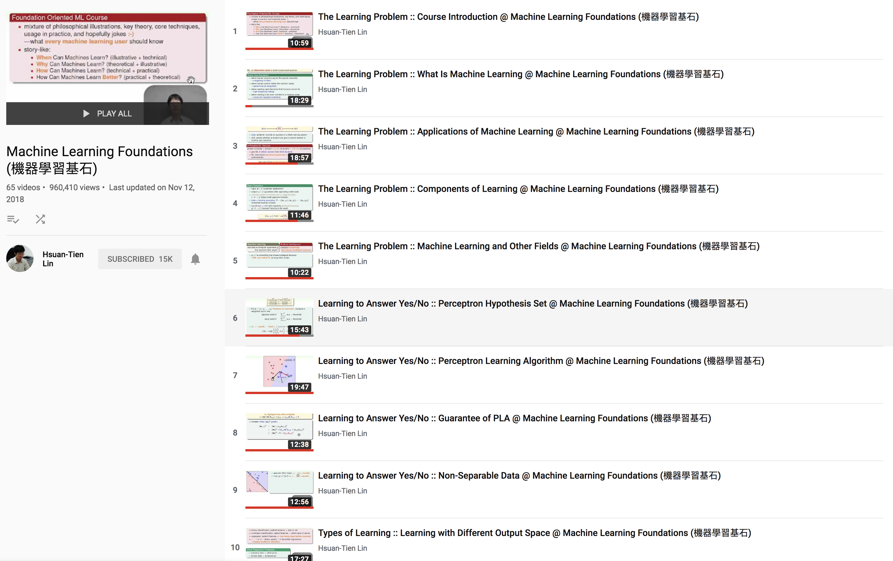

### youtube下载视屏集

如果只是下载单个视屏，很简单，只需要将视屏所在的页面，粘贴到这个[网站](https://qdownloader.net/)（https://qdownloader.net/），它会自动生成一个下载链接，点击下载就可以了。

但是如果是下载视屏集，将一个系列的视屏有序的下载下来，如果手动的一个一个去点击那效率就太慢了，所以这里介绍一种使用代码的形式下载。

1. 首先需要获得每个视屏所在的列表。访问到视屏所在的页面，有两种方式可以获得列表，一是通过下面这段js，在浏览器的控制台执行，就能获得列表

```javascript
for(var i in ytInitialData.contents.twoColumnWatchNextResults.playlist.playlist.contents){
console.log(ytInitialData.contents.twoColumnWatchNextResults.playlist.playlist.contents[i].playlistPanelVideoRenderer.navigationEndpoint.commandMetadata.webCommandMetadata.url);
}
```

另外一个就是通过代码的形式，一下是python代码：

```python
from selenium import webdriver
from selenium.common.exceptions import NoSuchElementException


driver = webdriver.Firefox()
driver.get("https://www.youtube.com/playlist?list=PLXVfgk9fNX2I7tB6oIINGBmW50rrmFTqf")

contents = driver.find_elements_by_id('content')
a=[]
for c in contents:
    print(c.text)
    try:
        a.append(c.find_element_by_tag_name('a').get_attribute("href"))
    except NoSuchElementException:
        print(0)


for aa in a:
    print(aa)
driver.close()
```

这里使用了selenium包，记得下载依赖。

2. 获得了视屏链接后就是去通过（https://qdownloader.net/）获得下载的地址，这里再次使用了python脚本

   代码如下：

   ```python
   from selenium import webdriver

   global _num
   _num = 1

   driver = webdriver.Firefox()


   def down_load(_url):
       driver.get('https://qdownloader.net/download?video=' + _url)
       contents = driver.find_element_by_tag_name('table').find_element_by_tag_name('tbody').find_element_by_tag_name('tr') \
           .find_element_by_tag_name('a').get_attribute("href")
       print(contents)


   with open("url.txt") as fh:
       for line in fh:
           down_load(line.strip())

   driver.close()
   ```

   这样就获得了下载的链接了。

   3. 最后就是去下载了，由于下载链接是https的，我对python不是很熟悉，导致一开始老是报错说是ssl的错误，网上找了一下，也没有个很好的解决方案，所以下载的时候使用了java代码，使用的是java的httpclient包，版本号是4.5.4，代码很简单，有一个需要注意的地方就是，访问下载链接的时候，第一次是需要302跳转的，而且跳转的时候，请求的host也跟着改变了，昨天就是在这个地方弄了很久，一直报400的错误，就是因为在处理了302的时候没有处理host。

      代码如下：

      ```java
      /**
           * 忽略ssl校验的https的get请求
           *
           * @param httpGetUrl
           * @param headers
           * @param cookieStore
           * @return
           */
          static HttpResponse sendSsoHttpsGet(String httpGetUrl, Header[] headers, CookieStore cookieStore) throws Exception {
              List<Header> headerList = new ArrayList<>();
              logger.debug("httpGetUrl : " + httpGetUrl);
              URI uri = new URI(httpGetUrl);
              headerList.add(new BasicHeader("Accept","text/html,application/xhtml+xml,application/xml;q=0.9,image/webp,image/apng,*/*;q=0.8"));
              headerList.add(new BasicHeader("Accept-Encoding","gzip, deflate, br"));
              headerList.add(new BasicHeader("Accept-Language","zh-CN,zh;q=0.9,en;q=0.8"));
              headerList.add(new BasicHeader("Cache-Control","no-cache"));
              headerList.add(new BasicHeader("Connection","keep-alive"));
              headerList.add(new BasicHeader("Host",uri.getHost()));
              headerList.add(new BasicHeader("Pragma","no-cache"));
              headerList.add(new BasicHeader("Upgrade-Insecure-Requests","1"));
              headerList.add(new BasicHeader("User-Agent","Mozilla/5.0 (Macintosh; Intel Mac OS X 10_13_4) AppleWebKit/537.36 (KHTML, like Gecko) Chrome/71.0.3578.98 Safari/537.36"));
              headerList.add(new BasicHeader("X-Client-Data","CIa2yQEIorbJAQjBtskBCKmdygEIqKPKAQi/p8oBCOynygEI4qjKARj5pcoB"));
              headers = headerList.toArray(new Header[headerList.size()]);
      //        SSLContextBuilder builder = new SSLContextBuilder();
      //        builder.loadTrustMaterial(null, new TrustAllStrategy());
              SSLContext sslcontext = SSLContexts.custom()
                               .loadTrustMaterial(new File("/Users/louis/Desktop/my.keystore"), "123456".toCharArray(),
                                   new TrustSelfSignedStrategy())
                               .build();
              sslcontext.init(null, new TrustManager[]{new TrustAnyTrustManager()}, new java.security.SecureRandom());
              SSLConnectionSocketFactory sslsf = new SSLConnectionSocketFactory(
                  sslcontext, new String[]{"TLSv1","TLSv1.1","TLSv1.2"},
                  null,
                  SSLConnectionSocketFactory.getDefaultHostnameVerifier());
              HttpUriRequest httpRequest = org.apache.http.client.methods.RequestBuilder.get().setUri(
                      new URI(httpGetUrl)).build();
              HttpParams params = httpRequest.getParams();
              params.setParameter(ClientPNames.HANDLE_REDIRECTS, false);
      //        httpRequest.setParams(params);

              if (headers != null && headers.length > 0) {
                  for (Header h : headers) {
                      httpRequest.setHeader(h);
                  }
              }
              CloseableHttpClient httpClient = HttpClients.custom().setDefaultCookieStore(cookieStore).setRetryHandler(new DefaultHttpRequestRetryHandler(3,true)).setSSLSocketFactory(sslsf).build();
              CloseableHttpResponse response = httpClient.execute(httpRequest);
              if(response.getStatusLine().getStatusCode()==302){
                  return sendSsoHttpsGet(response.getFirstHeader("Location").getValue(),headers,cookieStore);
              }
              System.out.println(httpGetUrl);
      //            JSONObject result = JSON.parseObject(EntityUtils.toString(response.getEntity()));
              return response;
          }
          //自定义私有类
          private static class TrustAnyTrustManager implements X509TrustManager {

              public void checkClientTrusted(X509Certificate[] chain, String authType) throws CertificateException {
              }

              public void checkServerTrusted(X509Certificate[] chain, String authType) throws CertificateException {
              }

              public X509Certificate[] getAcceptedIssuers() {
                  return new X509Certificate[]{};
              }
          }

           public static void main(String[] args)  throws Exception {
              System.setProperty("https.protocols", "TLSv1,TLSv1.1,TLSv1.2");
               //之前生成的下载链接的地址
              File file = new File("/Users/louis/PycharmProjects/selenium-test/com.aotain.selenium/1_down_url.txt");

              // This will reference one line at a time
              String line = null;

              try {
                  // FileReader reads text files in the default encoding.
                  FileReader fileReader = new FileReader(file);

                  // Always wrap FileReader in BufferedReader.
                  BufferedReader bufferedReader =
                      new BufferedReader(fileReader);

                  ExecutorService pool = Executors.newFixedThreadPool(3);
                  int i=1;
                  while((line = bufferedReader.readLine()) != null) {
                      if(StringUtils.isEmpty(line)){
                          continue;
                      }
                      String  ss = line;
                      URI uri = new URI(ss);
                      int ii = (i++);

                      pool.execute(new Thread(() -> {
                          try {
                              Thread.sleep(3000);
                          } catch (InterruptedException e) {
                              e.printStackTrace();
                          }
                        
                          HttpResponse response = null;
                          try {
                              response = sendSsoHttpsGet(ss,null,null);
                              System.out.println(response.getStatusLine());
                              File targetFile = new File("/Users/louis/Downloads/machine_learning/foundations/"+ii+".mp4");
                              InputStream initialStream = response.getEntity().getContent();
                              java.nio.file.Files.copy(
                                  initialStream,
                                  targetFile.toPath(),
                                  StandardCopyOption.REPLACE_EXISTING);

                              IOUtils.closeQuietly(initialStream);
                              System.out.println(ii+" success.");
                          } catch (Exception e) {
                              System.out.println(ii+" fail.");
                              e.printStackTrace();
                          }

                      }));
                      Thread.sleep(1000);
                  }

                  // Always close files.
                  bufferedReader.close();
              }
              catch(FileNotFoundException ex) {
                  ex.printStackTrace();
              }

          }
      ```

      代码很简单，没有什么可注释的，都看得懂。

      下载的时候会报这个错误，按照这连个网站的操作即可（https://www.jianshu.com/p/a1f47b8b4594），（https://zhuyuehua.iteye.com/blog/1102347）

      我自己的解决方法是先将证书下载下来，然后加到java的信任库里面

      打开命令行窗口，并到<java-home>\lib\security\ 目录下，运行下面的命令：

      ''keytool -import -alias "my alipay cert" -file steven.cert     -keystore my.keystore''，这里面的steven.cert就是下载网站的证书。

      本地测试有的时候还是会报错，把上面java代码中线程池的最大线程数量减小能减少报错的概率。

      ```java
      javax.net.ssl.SSLException: SSL peer shut down incorrectly
      	at sun.security.ssl.InputRecord.readV3Record(InputRecord.java:596)
      	at sun.security.ssl.InputRecord.read(InputRecord.java:532)
      	at sun.security.ssl.SSLSocketImpl.readRecord(SSLSocketImpl.java:983)
      	at sun.security.ssl.SSLSocketImpl.readDataRecord(SSLSocketImpl.java:940)
      	at sun.security.ssl.AppInputStream.read(AppInputStream.java:105)
      ```

      ​

